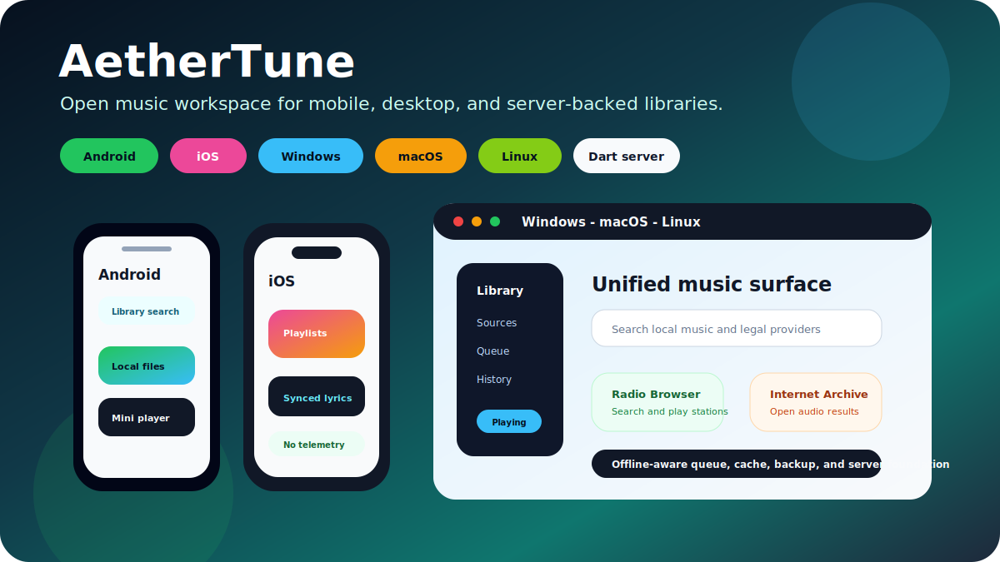
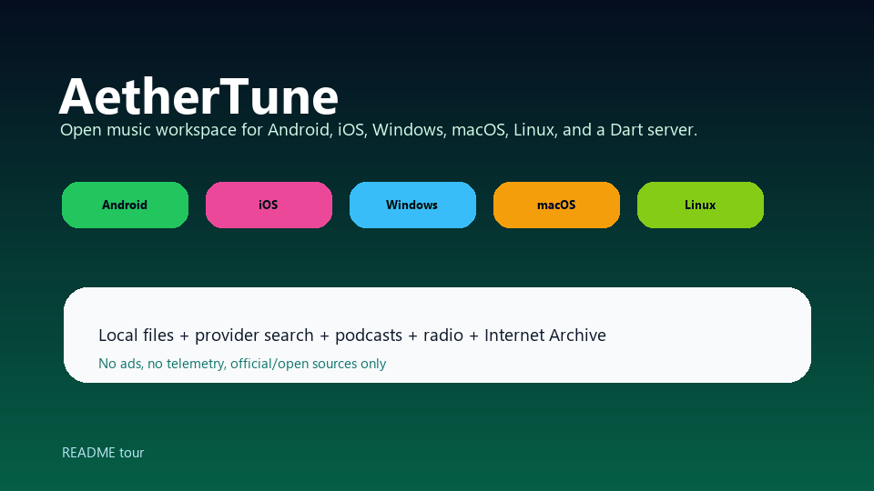
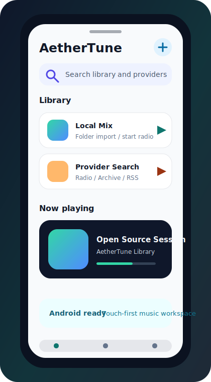
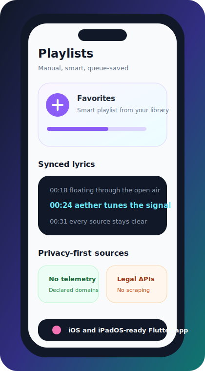
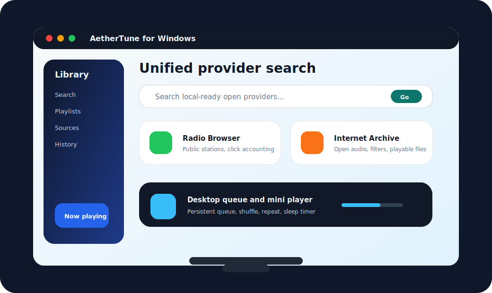
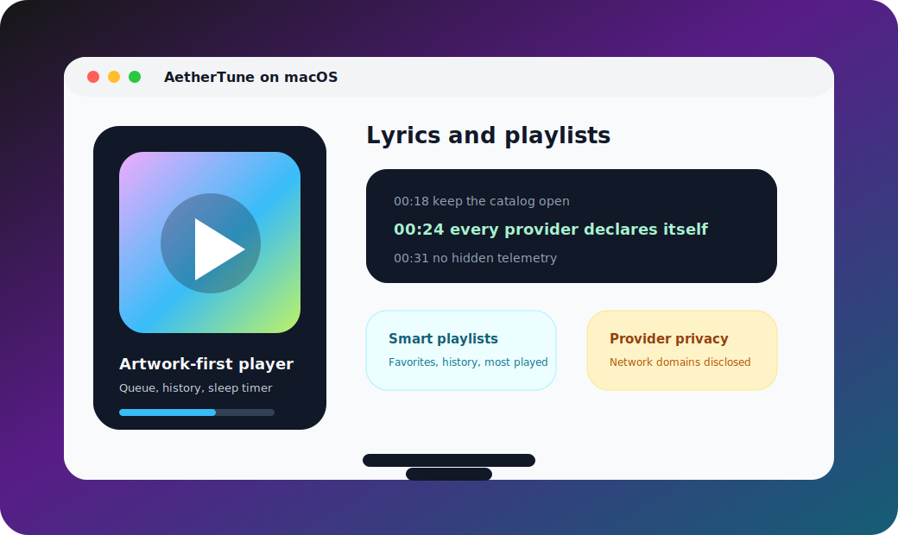
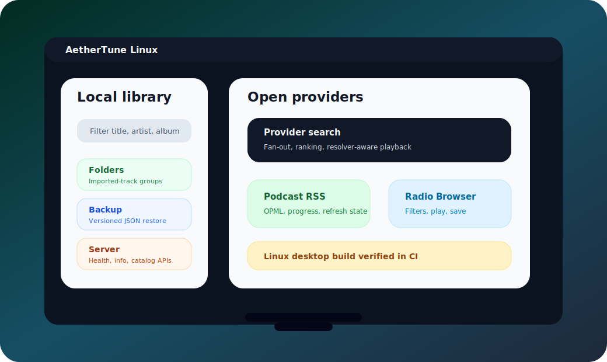
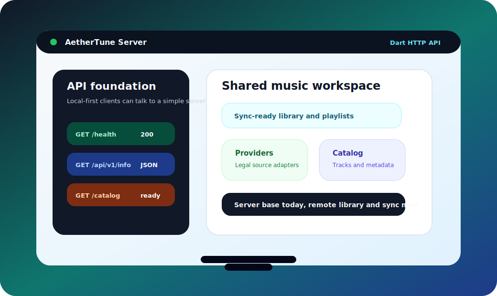

<h1 align="center">AetherTune</h1>

<p align="center">
  <strong>Free, open-source music workspace for mobile and desktop with local playback, open providers, playlists, lyrics, offline tools, and optional authenticated self-hosted library sync.</strong>
</p>

<p align="center">
  
  
  
  
  
</p>

<p align="center">
  <code>Dart 3</code> · <code>Flutter</code> · <code>Android</code> · <code>iOS</code> · <code>Linux</code> · <code>macOS</code> · <code>Windows</code> · <code>Server</code> · <code>MIT</code>
</p>

<p align="center">
  <a href="#quick-start">Quick Start</a> ·
  <a href="#what-is-aethertune">Overview</a> ·
  <a href="#platform-preview">Platform Preview</a> ·
  <a href="#implemented-now">Implemented Now</a> ·
  <a href="#feature-goal">Feature Goal</a> ·
  <a href="docs/ARCHITECTURE.md">Architecture</a> ·
  <a href="docs/USER_GUIDE.md">User Guide</a> ·
  <a href="docs/RELEASE_GUIDE.md">Release Guide</a> ·
  <a href="LICENSE">License</a>
</p>

<p align="center">
  <a href="docs/media/readme/aethertune-platform-overview.svg">
    
  </a>
</p>

<p align="center">
  <a href="docs/media/readme/aethertune-platform-tour.gif">
    
  </a>
</p>

<p align="center">
  <sub>Illustrated, repo-hosted product previews for Android, iOS, Windows, macOS, Linux, and the Dart sync server. Select any image to view it at full size.</sub>
</p>

---

## What is AetherTune?

**AetherTune** is a GitHub-ready project for a completely free and open-source music app, starting with a Flutter client targeting **Android, iOS, Linux, macOS, and Windows** plus a Dart server service. The project is designed to combine the best product ideas from apps such as Kreate, OpenTune, InnerTune, SimpMusic, ArchiveTune, Spotube, Echo Music, Namida, PipePipe, NewPipe, LibreTube, Musify, AuraMusic, Bloomee Tunes, Gyawun Music, Music You, Muzza, SoundPod, NouTube, Grayjay, OuterTune, ViTune, RiMusic, Harmony Music, YMusic, YouTube Music, Flow, and MetroList.

The app is intentionally **provider-based**: the player, library, queue, cache, favorites, playlists, search, and UI are open-source core features, while source adapters can be added for legal sources such as local files, self-hosted servers, Internet Archive, Radio Browser, Jellyfin, Navidrome/Subsonic, podcasts, or other official APIs.

> Important: this repository does **not** include DRM bypass, paid-service cloning, credential stealing, private API scraping, or any code intended to violate a platform's terms. You can build legal source adapters through the provider interface.

## Platform Preview

These generated product illustrations introduce each supported surface before someone builds the project locally; they are not device screenshots. The Flutter client targets Android, iOS, Linux, macOS, and Windows. CI compiles every target, the release workflow packages Android and desktop artifacts, and the optional Dart server provides authenticated, versioned library snapshots. The animated tour above is generated by `scripts/dev/render_readme_tour.py`; all checked-in README media lives in `docs/media/readme/` so GitHub does not depend on an external image host.

| Surface | What the README media introduces |
|---|---|
| Android | Touch-first library search, provider search, start-radio queues, and responsive mini/full player |
| iOS | Playlists, synced lyrics, history, and privacy-first sources |
| Windows | Wide desktop layout with provider search, radio queues, and playback controls |
| macOS | Artwork-first player, lyrics, playlists, and provider privacy |
| Linux | Local library, folders, open providers, backup, and server-friendly foundations |
| Server | Health/info/catalog APIs plus authenticated, checksum-verified library snapshot upload and download |

### Mobile previews

| Android | iOS |
|---|---|
| <a href="docs/media/readme/aethertune-android.svg"></a> | <a href="docs/media/readme/aethertune-ios.svg"></a> |
| Library search, provider search, local playback, start radio, and mini player | Playlists, synced lyrics, privacy notes, and iOS/iPadOS-ready layout |

### Desktop previews

| Windows | macOS | Linux |
|---|---|---|
| <a href="docs/media/readme/aethertune-windows.svg"></a> | <a href="docs/media/readme/aethertune-macos.svg"></a> | <a href="docs/media/readme/aethertune-linux.svg"></a> |
| Unified search, radio queue, and mini player on a wide desktop surface | Artwork, lyrics, smart playlists, and provider privacy | Local library, folders, backup, providers, and Linux CI coverage |

### Server preview

<p align="center">
  <a href="docs/media/readme/aethertune-server.svg">
    
  </a>
</p>

The server preview covers the Dart service that ships with the repo: health checks, API info, catalog endpoints, operator-configured bearer authentication, and durable per-user library snapshots with optimistic conflict detection. See [`services/server/README.md`](services/server/README.md) before exposing it to a network.

## Quick Start

The bootstrap requires Flutter and Python 3. Python applies and validates the
generated Android/iOS/macOS media-session and secure-storage settings.

```bash
git clone https://github.com/YOUR_NAME/aethertune.git
cd aethertune

# Creates mobile and desktop platform wrappers when they are not already generated.
./scripts/bootstrap_client.sh

cd apps/mobile
flutter pub get
flutter run
```

To run the server:

```bash
cd services/server
dart pub get
dart run bin/server.dart
```

To build release packages:

```bash
cd apps/mobile
flutter build apk --release
flutter build appbundle --release
flutter build ios --release
flutter build linux --release
flutter build macos --release
flutter build windows --release
```

## Implemented Now

This scaffold includes real app code, not only a README:

| Area | Implemented in this project |
|---|---|
| Mobile app | Flutter app shell for Android and iOS |
| Desktop app | Same Flutter client builds for Linux, macOS, and Windows in CI, with a desktop-width navigation rail |
| Server | Dart HTTP service with health/info/catalog endpoints plus authenticated `GET`/`PUT /api/v1/sync/library`, durable per-user snapshots, checksums, size limits, and optimistic revision conflicts |
| Cross-device sync | Options can test and securely save a sync server/token, upload a portable library snapshot, download it with destructive confirmation, and explicitly resolve stale-revision conflicts by choosing the server or this device; optional automatic uploads run every 15 minutes while the app is foregrounded and never download or overwrite automatically; snapshots exclude credentials, device-local paths, private cache files/jobs, and device cache/offline settings, while downloads reattach matching local files |
| Playback | Responsive mini/full Now Playing surfaces with artwork swipe navigation, seek/time labels, favorite, queue, lyrics, shuffle/repeat and transport controls; native playlist-backed `just_audio` controller for gapless local/URL queues; Android notification controls; iOS/macOS Control Center metadata and transport controls; configured mobile music sessions and background-audio wrappers; native Android/iOS/macOS playback backends; and bundled MediaKit audio backends for Linux/Windows |
| Local library | Import audio files through the native file picker or recursive folder scanner with filename metadata parsing plus basic ID3v1/ID3v2 MP3, FLAC Vorbis comment, M4A metadata atom, and WAV RIFF INFO parsing, matching `.lrc`/`.txt` lyric sidecars, plus embedded MP3/FLAC/M4A artwork display; edit saved metadata; resolve duplicates; search, sort, suggestion chips, and browse by artist, album, genre, source, flat folder groups, or recursive folder tree |
| Persistence | Saves imported tracks, favorites, playlists, lyrics, podcast feed subscriptions, podcast refresh status, podcast episode progress, playback history, submitted search history, pause-listening-history preference, theme and accent preferences, offline mode, app/provider offline cache size limits, and the offline cache/download queue with byte-count/checksum metadata in `shared_preferences`; self-hosted provider secrets are excluded and stored through the platform credential vault |
| Backup/restore | Save or restore a versioned UTF-8 JSON backup through the native file dialog, or view/paste the JSON fallback, including submitted search history, pause-listening-history preference, theme and accent preferences, offline mode, app/provider offline cache size limits, and queued offline media requests with cache metadata, from the Options tab |
| Home feed | Local Home tab sections for recommendations, mood/activity mixes, continue listening, recently played, radio seeds, most played, favorites, recently added tracks, and range-filtered local charts with responsive top-track/top-artist bars |
| Search | Typo-tolerant local library filtering by title, artist, album, genre, source, folder, saved lyrics, favorites, and local-files-only offline readiness with sortable results and suggestion chips from submitted searches, playback history, and library metadata |
| Queue | Play the current list through one lazy gapless native playlist with automatic transition tracking, persistent next/previous/shuffle/repeat state, position-preserving reorder/remove controls, local track radio, similar tracks, privacy-safe sharing, and save-as-playlist |
| History/stats | Recently played tab with local playback history, typo-tolerant history search, persisted named range/query views, per-play entry deletion, play counts, responsive top-track/top-artist charts, monthly/yearly recap cards with cross-platform PNG export, date ranges, JSON/CSV stats export, top tracks/artists/albums/genres, clear action, and a persisted pause-listening-history privacy toggle |
| Playlists | Built-in and custom rule smart playlists plus create, rename, folder organization/filtering, artwork URL edit, delete, open, find within, reorder, import/export JSON/M3U/CSV, copy playlist share text, and play manual playlists |
| Lyrics | Add, import, export, edit, view, search, and delete plain text or LRC timestamped lyrics, including user-triggered LRCLIB plain/synced search with local attributed caching, matching folder-scan sidecars, playback-linked synced highlighting, and attributed copyable lyrics excerpts |
| Favorites | Toggle favorites per track |
| Sleep timer | Stop playback after presets, a custom 1-1440 minute duration, or the current track, with optional 10-second, 30-second, 1-minute, or 2-minute fade-out |
| Repeat/shuffle | Persisted shuffle flag and repeat mode |
| Provider architecture | `MusicSourceProvider`, `MusicCatalogProvider`, `MusicPlaylistMutationProvider`, and `LyricsProvider` interfaces with privacy/network disclosure, offline cache/download policy gates, persisted offline request queue, user-triggered checksum-verified private media cache storage, unified music-provider search, LRCLIB plain/synced lyrics search, demo provider, Podcast RSS feeds, Radio Browser, Internet Archive, and configurable Jellyfin/Navidrome/Subsonic accounts with secure credentials, test-before-replace credential rotation, salted Subsonic tokens, catalog browsing, credential-safe artwork, and remote playlist editing |
| Documentation | README, feature matrix, architecture, user guide, release guide, legal notes |
| GitHub readiness | MIT license, CI workflow, issue templates, contribution guide, security policy |
| Proof gates | CI analyzes/tests Flutter, runs provider and system-media contract tests, compiles an Android APK and unsigned iOS app, builds all desktop targets, analyzes/tests/compiles the server, and defines tag/manual release artifacts |

## Feature Goal

AetherTune is designed to support the combined feature categories users expect from modern free/open music clients:

| Feature category | Target support |
|---|---|
| Local files | Library import, recursive folder scanner with filename metadata parsing, basic ID3v1 MP3 title/artist/album tags, basic ID3v2 MP3 title/artist/album/genre text tags and APIC/PIC artwork, basic FLAC Vorbis comment title/artist/album/genre tags and picture artwork, basic M4A title/artist/album/genre metadata atoms and `covr` artwork, basic WAV RIFF INFO title/artist/album/genre tags, playback, search, favorites, recently added sorting, imported-folder browsing, stored metadata editing, duplicate resolver scaffold, folder-watch roadmap, and richer tag scanner/writer roadmap |
| History/stats | Recently played, local play counts, typo-tolerant history search, persisted saved range/query views, per-play entry deletion, estimated listening time, responsive top-track/top-artist bar charts, monthly/yearly calendar recap cards with saveable PNG share visuals, JSON/CSV export, top track/artist/album/genre recap, and a persisted pause-listening-history privacy toggle implemented; calendar heatmaps and saved visual themes remain |
| Backup/restore | Versioned JSON library backup with native file save/open and view/paste fallback |
| Streaming providers | Pluggable provider interface with declared capabilities, permissions, network disclosure, and cache/download policy gates for legal source adapters |
| Offline | Local-first data model, offline library filter, persisted offline mode that pauses network-backed source actions and player-wide saved stream playback, per-provider cache/download policy gate, persisted pause/resume-capable cache/download queue manager, checksum-verified private direct-URL cache storage with HTTP Range retry resume, usage/trim/clear/app-provider quota controls, user-chosen folder export, and automatic post-cache pressure eviction; background download jobs remain roadmap |
| Music discovery | Local Home feed sections, range-filtered local charts, local mood/activity mixes, personalized local recommendations, similar local tracks, and seed-based track radio queues implemented; provider home feeds, provider charts, provider moods, richer radio, similar artist/album pages, and provider recommendations remain roadmap |
| Lyrics | Plain text and synced LRC editing, UTF-8 file/sidecar import, user-triggered LRCLIB search with local match ranking and attributed persistence, native TXT/LRC save dialogs and copyable export text, local saved-lyrics search, playback-linked synced highlighting, and attributed bounded share excerpts implemented; rendered lyric cards, more provider adapters, and platform share sheets roadmap |
| Playlists | Manual playlists, private local-image or web artwork, built-in smart playlists, custom smart rules, in-playlist search, track reordering, native JSON/M3U/CSV file import/export with paste/view fallback, copyable share text, save-queue-as-playlist, and manual whole-library snapshot sync implemented; automatic per-playlist merge, synced rules, artwork cropping/collages, native share sheets, and artwork-file sync remain roadmap |
| Android integrations | Queue-aware media notification, artwork/metadata, play/pause/seek/previous/next/stop, repeat/shuffle, media-button receiver, foreground media service, and background playback configuration implemented; physical-device lifecycle tests and Android Auto browsing remain roadmap |
| iOS integrations | Control Center and lock-screen queue metadata/artwork/transport controls plus music-session background audio configuration implemented; physical-device interruption/lifecycle tests and CarPlay browsing remain roadmap |
| Desktop | Linux/macOS/Windows build support with a responsive navigation rail at desktop widths; split panes, global hotkeys, tray/menu bar, and installer polish roadmap |
| Server | Health/info/catalog APIs plus a versioned authenticated library snapshot API and durable latest-revision store implemented; optional client-side automatic foreground upload is available, while account registration, token lifecycle, automatic merge/background sync, deployment hardening, and remote provider coordination remain roadmap |
| UI customization | Material 3 shell with persisted system/light/dark/AMOLED theme preference and persisted accent color swatches; dynamic platform color roadmap |
| Privacy | No telemetry, no ads, no tracking, no forced account, provider disclosure, and a local pause-listening-history control |
| Multi-source | Local provider support plus offline-mode network pausing and saved stream playback blocking, unified provider search across the local library and legal adapters with offline local-only search, Podcast RSS feed subscriptions/play/save/OPML/refresh status/progress resume/cache-download queue and private cache eligibility/eviction, Radio Browser mirror discovery/search/filter/stream validation/play/save/click accounting with live-stream cache/download denial, paginated Internet Archive audio search/filter/facet suggestions/item details/play/save/cache-download queue and private cache eligibility/eviction with multi-file item results, and Sources-tab Jellyfin plus Navidrome/Subsonic accounts with connection testing, secure secret storage, atomic credential rotation with rollback, salted Subsonic tokens, search, runtime-only stream resolution, dedicated catalog browsing, bounded credential-safe in-app/system artwork, and remote playlist create/rename/delete/add/remove/reorder; portable manual library snapshots can cross devices without provider credentials or private media, while automatic merge and official API providers remain roadmap |

For the full truth table, see [`docs/FEATURE_MATRIX.md`](docs/FEATURE_MATRIX.md). The matrix separates **implemented**, **scaffolded**, **planned**, and **not included** features so the project does not make fake “100% done” claims.

## Project Layout

```text
aethertune/
├─ apps/mobile/                 # Flutter client app for mobile and desktop
│  ├─ lib/src/domain/            # Track and provider contracts
│  ├─ lib/src/data/              # Local persistence and demo provider
│  ├─ lib/src/player/            # Playback controller
│  └─ lib/src/ui/                # App UI
├─ services/server/              # Dart HTTP server package
├─ docs/                         # Architecture, matrix, user/release/legal docs
├─ scripts/                      # Bootstrap and check scripts
├─ .github/workflows/            # GitHub Actions CI
├─ LICENSE                       # MIT license
└─ README.md                     # Landing page
```

## Why this name?

**AetherTune** = music that can come from many “air”/network/local sources while remaining transparent, open, and user-controlled.

## Non-goals

AetherTune is not a piracy tool, not a YouTube Music Premium replacement, not a DRM bypass project, and not a private API scraper. The right way to expand it is through legal, documented, or user-owned sources.

## Contributing

Pull requests are welcome. Start with [`CONTRIBUTING.md`](CONTRIBUTING.md), then check [`docs/ARCHITECTURE.md`](docs/ARCHITECTURE.md) and [`docs/API_PROVIDERS.md`](docs/API_PROVIDERS.md).

## License

AetherTune is released under the **MIT License**. See [`LICENSE`](LICENSE).
